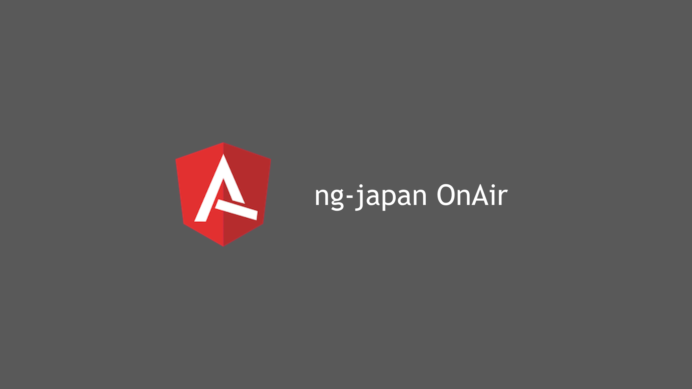

# ng-japan OnAir

## ng-japan OnAirって何？

ng-japanによるオンラインイベントです。

### 目的

- 最新情報やプラクティスをキャッチアップする機会は多い方がいい
- 勉強会やミートアップは東京に集中してるし、予定が合わないと参加できない
- オンライン開催なら誰でもどこでも参加できるしアーカイブが残る！ :tada:

### 何するの？

- ライトニングトーク
- ディスカッション
- その他いろいろ

YouTube Liveを使ってできることをいろいろ模索しようと思います。リクエストがあれば [Issue](https://github.com/ng-japan/on-air/issues/2) へ気軽に投稿してください。

## 過去の内容

### #1

YouTube: https://www.youtube.com/watch?v=wkxDNNMRZd8

- 最近のニュース 5.2.0リリースとv6 LTS (@lacolaco)

### #0 

YouTube: https://www.youtube.com/watch?v=0I6bwpuV9Pk

- ng-japan OnAirの紹介
- Angular v5について (@lacolaco)
